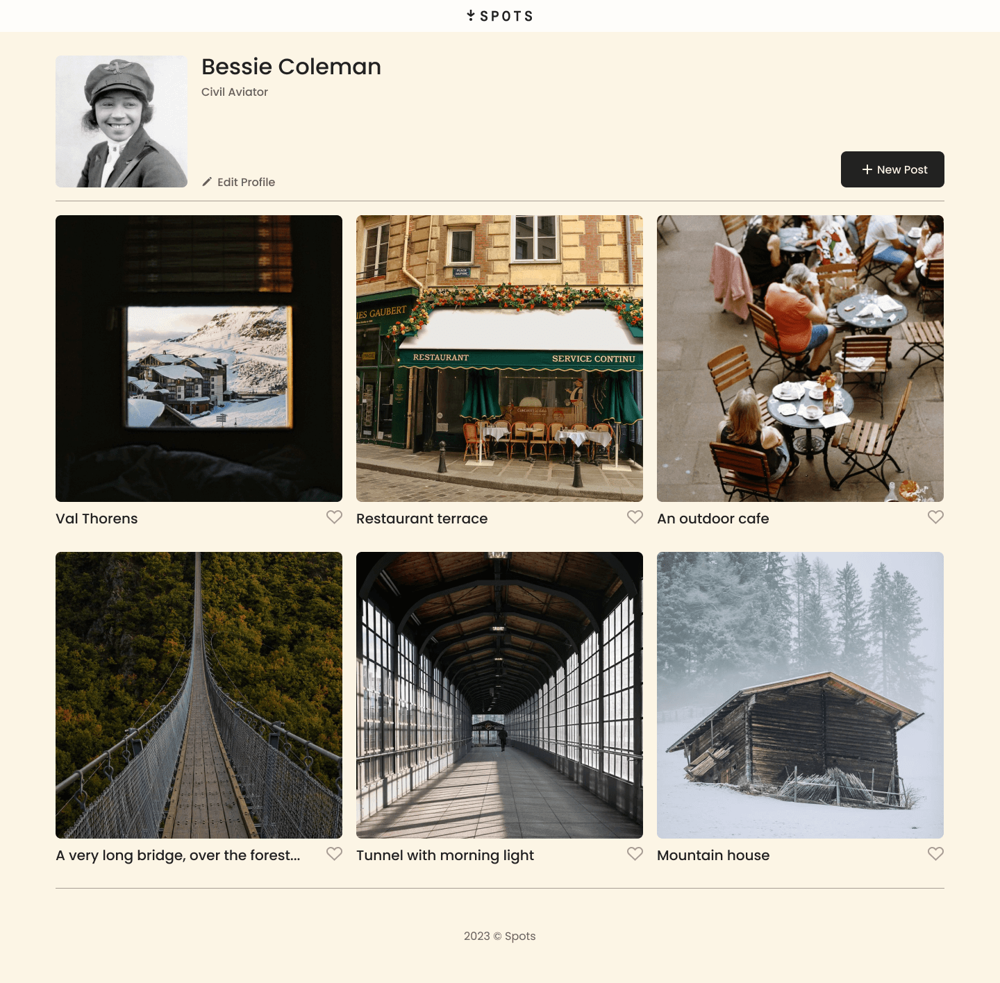
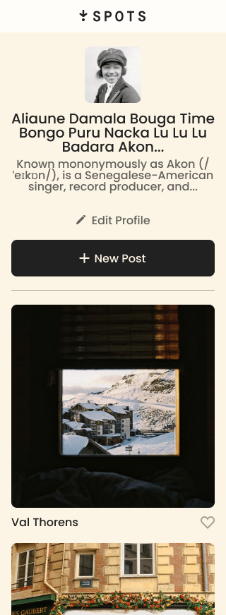

# Project 3: Spots

## What is Spots?

Spots is the 3rd project through [TripleTen](https://tripleten.com/), a social media website for sharing your favorite Spots from around the world.

The layout of the site can resemble other popular social media platforms like Instagram, constructed using grid.

Spots serves primarily as an intro to responsive design; compatable with mobile, tablet and desktop views.

Currently, Spots only serves front-end, with UX in mind; additional functionality planned for future updates.

### How was it built?

Spots consists of two main sections:

- Header

  - Nested flexbox for positioning simplicity
  - Media queries for altering layout on smaller devices
  - Comfortable text cutoff using clamp and text-overflow

- Cards
  - Grid for positioning the posts
    - 3x2 (**Width** $\ge$ 1030px)
    - 2x3 (1029px $\ge$ **Width** $\ge$ 685px)
    - 1x6 (684px $\ge$ **Width**)
  - Flexbox for arranging content within the posts

The grid design allows for additional posts (or cards) to be added in the future with minimal adjustments needed.

### Images

Spots rendered within a 1440px display:

Spots rendered within a 320px display:

## Spots Dev Logs

Check out this short [video demonstration](https://drive.google.com/file/d/1augVytaOpZlriFWEhCsoNoDkEMOR9AYm/view?usp=sharing) about the site and how it was made.

Linked is my short [product pitch](https://drive.google.com/file/d/1S-zPKiIMQnuAg7edv9JqngniYKTdVXH1/view?usp=drive_link) for Spots, as well as some of the challenges I personally faced and how I was able to overcome them.

### See it for yourself!

You may view the site in action through my [GitHub Pages deployment](https://o-p-e-n-b-a-l-l.github.io/se_project_spots/).
